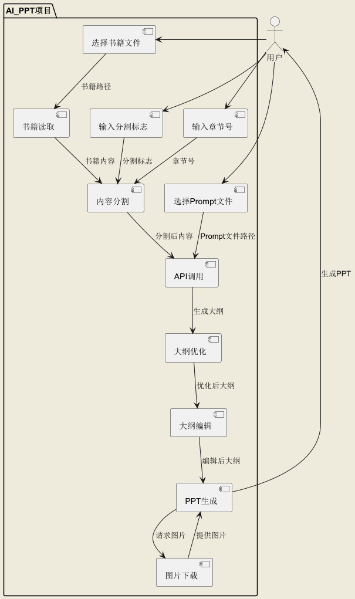

# AI_PPT项目说明

## 一、项目概述
AI_PPT是一个能够将书籍文件转换为PPT的项目，支持多种书籍文件格式（如.epub、.pdf、.txt、.docx）。用户通过输入书籍文件、prompt文件、导出位置、分割标志和选择的章节号，项目会并行调用通义千问的API生成md格式的PPT大纲，用户可调整大纲，之后利用md2pptx生成PPT，并从搜索引擎下载图片导入其中，最终生成各章节对应的PPT。

## 二、功能特性
1. **多格式书籍支持**：可处理.epub、.pdf、.txt、.docx格式的书籍文件，方便用户导入不同来源的书籍内容。
2. **灵活分割与章节选择**：用户能自定义分割标志，并选择特定章节生成PPT，满足不同需求。
3. **API调用生成大纲**：借助通义千问API，根据书籍内容和prompt要求生成结构清晰的PPT大纲。
4. **大纲调整与预览**：提供可视化的大纲编辑界面，支持实时预览修改效果，方便用户优化内容。
5. **自动图片下载与导入**：利用Image-Downloader从搜索引擎获取相关图片，并自动导入PPT，增强展示效果。

## 三、安装指南
1. 安装项目所需依赖库：
   - 使用`pip install -r requirements.txt`命令安装（需提前准备好包含所有依赖库的`requirements.txt`文件）。
2. 获取通义千问API的访问密钥，并设置为环境变量`API_KEY`。

## 四、使用方法
1. **运行程序**：执行`main.py`文件启动项目，将显示图形用户界面（GUI）。
2. **选择书籍文件**：点击“选择书籍文件”按钮，从文件系统中选择要转换的书籍文件，支持.epub、.pdf、.txt、.docx格式。
3. **选择Prompt文件**：点击“选择Prompt文件”按钮，选择用于指导API生成大纲的Prompt文件，仅支持.txt格式。
4. **选择导出位置**：点击“选择导出位置”按钮，选择生成PPT文件所导出的位置。
5. **设置分割标志**：在“分割标志，用换行符分隔”文本框中输入用于分割书籍内容的标志。
6. **选择章节**：在“选择章节，用逗号分隔”文本框中输入要生成PPT的章节号，确保章节号在有效范围内。
7. **生成大纲**：点击“下一步”按钮，程序将根据设置并行调用API生成PPT大纲，生成过程中会显示加载界面。
8. **编辑大纲**：大纲生成后，可在弹出的编辑窗口中修改大纲内容，左侧为大纲源码编辑区，右侧为实时预览区，修改后可点击“保存当前md文件”保存。
9. **生成PPT**：点击“生成ppt”按钮，程序将遍历大纲文件，利用md2pptx生成PPT，并自动从搜索引擎下载图片导入，生成的PPT将保存到指定输出位置。
10. **查看PPT**：在生成PPT完成后，可在弹出的窗口中点击PPT文件进行查看，将使用系统默认程序打开PPT。

## 五、文件结构
1. **`md_optimize`**：负责优化md文件，添加图片链接等操作。
2. **`readBook`**：包含多种书籍文件格式（.txt、.pdf、.docx、.epub）的读取函数，为项目提供书籍内容获取功能。
3. **`ACsearch`**：采用正则匹配和AC自动机算法，在书籍内容中搜索分割标志，以便分割书籍内容。
4. **`callAPI`**：主要功能是调用通义千问API，根据书籍内容和prompt生成md格式的PPT大纲，并保存相关文件。
5. **`createGUI`**：构建项目的图形用户界面，实现用户与项目的交互操作，包括文件选择、参数设置、大纲编辑、PPT生成等功能的界面展示和逻辑处理。
6. **`getPicture`**：用于调用Image-Downloader从搜索引擎下载图片，为PPT提供图片素材。
7. **`main`**：项目的入口点，启动图形用户界面。

## 六、技术细节
1. **书籍内容读取**：针对不同格式文件采用相应的读取方式，如使用`fitz`库读取PDF、`docx`库读取DOCX等，最终统一返回文本内容。
2. **内容分割**：利用正则匹配以及改进的AC自动机算法，根据用户设置的分割标志，在书籍内容中准确找到分割点，同时不改变书籍中出现的各种空白符号，将书籍内容分割为多个部分，便于后续按章节处理。
3. **API调用**：构建请求参数，调用通义千问API，将书籍内容和prompt信息发送给API，获取返回的md格式大纲，并保存到本地文件系统。
4. **图片链接添加**：读取大纲文件，根据其中的图片关键词，调用Image-Downloader子项目下载图片，并将图片链接添加到大纲文件中，生成更丰富的PPT。
5. **大纲编辑**：提供了可视化的大纲编辑界面，左侧为大纲源码编辑区，右侧实时预览编辑效果。编辑时右侧预览区同步更新，方便用户实时查看效果并调整。
6. **PPT生成**：通过调用md2pptx子项目，将优化后的大纲文件转换为PPT文件，并将下载的图片导入到PPT中，最终生成完整的PPT。

## 七、开源项目引用说明
- https://github.com/MartinPacker/md2pptx，基于MIT协议
- https://github.com/QianyanTech/Image-Downloader，基于MIT协议

该程序目前仅能生成最基本的ppt，更多功能敬请期待，期待你的加入!
- 项目版本: 1.0
