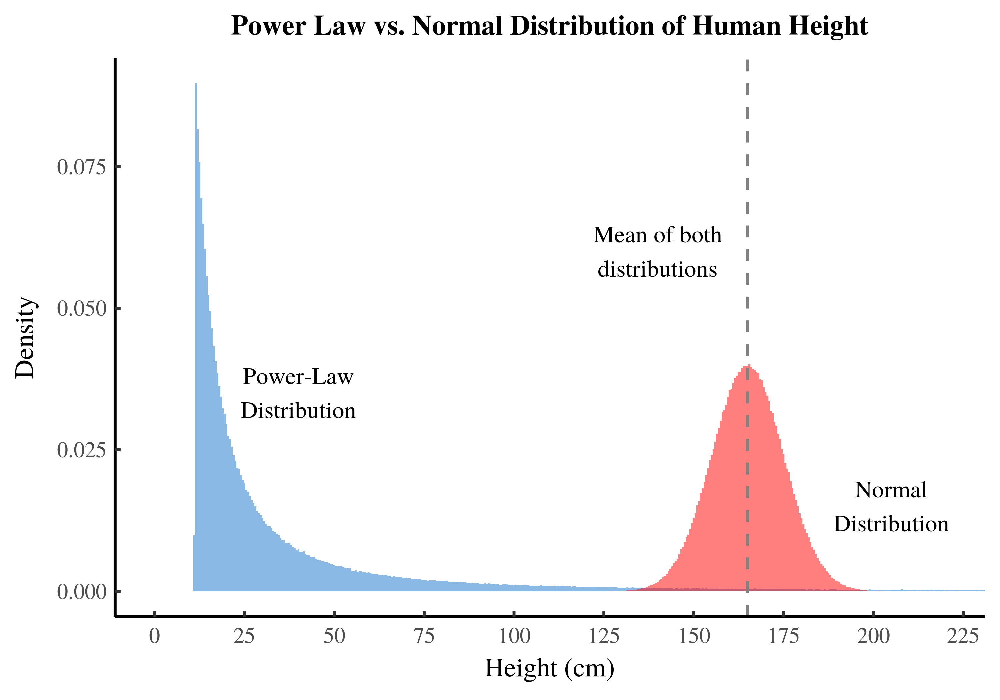

template: Martin Template.pptx
cardlayout: horizontal
baseTextSize: 20
CardPercent: 50
CardTitleSize: 25
CardColour: #D2E2FA, #F0F0F0
backgroundImage: 
CardTitlePosition: inside
cardshadow: yes
cardshape: rounded

# 幂律——复杂网络的分布规律
《链接》第六链导读

### 课程目标

#### Target 1
* 理解《链接》的整体框架与思想  

#### Target 2
* 掌握幂律分布和无尺度网络的核心概念  

#### Target 3
* 探索复杂网络的自组织现象

#### Target 4
* 理解幂律如何在现实生活中产生影响

### 整本书的介绍

#### Introduction
* **书名**：《链接：商业、科学与生活的新思维》 
* **作者**：阿尔伯特-拉斯洛·巴拉巴西 
* **主题**：复杂系统中的网络结构与演化规律 

#### 核心思想
* 网络的形成并非完全随机，而是自组织和高度有序的。
* 无论是互联网、社交网络还是基因网络，都呈现类似的幂律分布。 
* 少数枢纽节点在保持系统稳定与活力中起关键作用。

###  全书框架及第六链的位置
* **第一链**：网络与节点——网络结构的基础
* **第二链**：随机网络——早期图论模型 
* **第三链**：小世界网络——解释网络的短路径现象 
* **第四链**：聚团效应——群体行为的形成 
* **第五链**：富者愈富——累积优势和资源分配 
* **第六链**：**幂律——复杂网络的分布规律** 
* **第七链**：网络的鲁棒性与脆弱性 
* **第八链及后续**：未来网络科学的挑战 

###  幂律分布的核心概念
* **幂律分布**是一种特殊的概率分布，其特点是大多数事件的规模很小，但少数事件的规模非常大。这意味着事件规模的分布呈现一种没有峰值的递减趋势。
* 幂律分布的特点

	1. **无峰值**：不像正态分布，幂律分布没有平均值附近的集中趋势。

	2. **长尾效应**：极大事件（如极高链接数的网站或超级富豪）虽然少见，但并非不可能。

	3. **不均衡性**：大量的“小”节点与少数极端“大”节点共存。

### The end
|Bucket|Minimum % Of Goal|Maximum % of Goal|PI Value|
|-:|--:|--:|-:|
|1|0|**50**|0.5|
|2|50|60|0.6|
|3|60|70|0.7|
|4|70|80|0.8|
|5|80|90|0.9|
|6|90|**100**|1.0|
|7|100|110|1.1|
|8|110|120|1.2|
|9|120|130|1.3|
|10|130|140|1.4|
|11|140|150|1.5|
|12|150|200|2.0|
|13|200|**400**|4.0|
|14|**400**|**&infin;**|4.0|